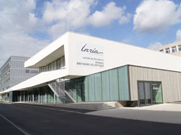

# How to participate
To participate you need to register (step 1/2) and potentially, to submit an abstract (step 2/2). 

<u>Deadline:</u> January 20

### 1/2: Registration (mandatory) 

* Participation is free, but registration is mandatory. Please fill this [form](
  https://sondages.inria.fr/index.php/813188?lang=en). 

==Note== the form is filled in to steps:

1. Fill your name and email address
2. You'll receive an email with a link for finishing the registration. 

The number of attendees is limited. Avoid late registrations.

### 2/2: Submit an abstract
If you wish to present a talk, submit your abstract via [EasyChair](https://easychair.org/my/conference?conf=dsb2020)

As previously, there is no formal review, and the organizers reserve the  right to select talks from the submissions to obtain a diverse and  interesting program. 

## Program
[Program (pdf)]({{ site.baseurl }})

## Participants

[Find your name here]({{ site.baseurl }})

## Mailing List
We use the dsb2020@inria.fr mailing list for discussions and the diffusion of fresh informations. Most of you are already registered.
* to subscribe: send a mail to [sympa_inria@inria.fr](mailto:sympa_inria@inria.fr) with title `subscribe dsb2020 first-name last-name`
* to unsubscribe: send a mail to [sympa_inria@inria.fr](mailto:sympa_inria@inria.fr) with title  `unsubscribe dsb2020`

# Pratical
#### When
<!-- * any time before January 15: register and submit a talk (via [EasyChair](https://easychair.org/my/conference?conf=dsb2020)) -->
* February 3 (Monday): arrival and evening welcome reception (no talks)
* February 4 (Tuesday): first workshop day; dinner
* February 5 (Wednesday): second workshop day

#### Where
 The workshop will take place at Inria Center - Rennes - France
[How to reach the center](http://www.irisa.fr/en/access-map).

How to get there?

* From the SNCF railway station
  * [By public transport](https://www.star.fr/accueil/)
    1. Take the Metro  at Gares (Rennes) station in the direction of *J.F. Kennedy (Rennes)*, get off at `République` station.
    2. At `République` station, take either one of the follwing buses and get off at `Tournebride`.
      * the bus line  towards *ZA Saint Sulpice*
      * the bus line  towards *Cesson-Sévigné/Chantepie*
      * the bus line  towards *Beaulieu Atalante*
  * By taxi: The average price of the race of around 15 € during the day.
* From Rennes Saint-Jacques airport
  * By bus : Take the bus line  direction *Cesson-Sévigné Rigourdière*. Get off at the stop `Tournebride` ([learn more about the public transport network](https://www.star.fr/accueil/))
  * By taxi : The average price of the race is around 35 € during the day.

Join Inria from the `Tournebride` stop:
<iframe src="https://www.google.com/maps/embed?pb=!1m28!1m12!1m3!1d1331.8723387906512!2d-1.6395825416157417!3d48.1151608448054!2m3!1f0!2f0!3f0!3m2!1i1024!2i768!4f13.1!4m13!3e2!4m5!1s0x480edee5a599f107%3A0x318da7854b094389!2sInria%20Rennes%20-%20Bretagne%20Atlantique%2C%20Avenue%20G%C3%A9n%C3%A9ral%20Leclerc%2C%20Rennes!3m2!1d48.1163823!2d-1.6397096999999998!4m5!1s0x480edee6b75525cb%3A0xc4eb14400bd802a5!2sTournebride%2C%2035510%20Cesson-S%C3%A9vign%C3%A9!3m2!1d48.114025!2d-1.636082!5e0!3m2!1sen!2sfr!4v1580396543307!5m2!1sen!2sfr" width="600" height="450" frameborder="0" style="border:0;" allowfullscreen=""></iframe>

We advice you to book an hotel in the city center. The campus is accessible by bus in about fifteen minutes from the city centre

### Hotels
Here is a list of hotels in the city centre of Rennes from where it is easy to take the bus to reach the Inria center:

- [Mercure Place de Bretagne](https://all.accor.com/hotel/2027/index.fr.shtml) 
- [Hôtel Lanjuinais](https://www.hotel-lanjuinais.com/) 
- [Hôtel Le Florin](https://www.hotel-leflorin-rennes.fr/) 
- [Hôtel Astrid](http://www.hotel-astrid-rennes.eu/en/) 
- [Aparthotel Adagio](https://www.adagio-city.com/gb/hotel-8398-aparthotel-adagio-access-rennes-centre/index.shtml) 

## Supports
This meeting is supported by 
 * [Inria](http://www.inria.fr)

 * [CNRS GDR BIM](http://www.gdr-bim.cnrs.fr/)

 * [CNRS GDR IM](https://www.gdr-im.fr/)

 * [Université de Rennes 1](https://international.univ-rennes1.fr/)

 * [IFB](https://www.france-bioinformatique.fr/)

   

## Organizers

* Lolita Lecompte
* Marie Le Roïc
* Téo Lemane
* Pierre Peterlongo
