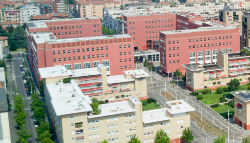

# How to participate
To participate you need to register (step 1/2) and potentially, to submit an abstract (step 2/2).

<u>Deadline:</u> January 27

### 1/2: Registration (mandatory)

* Participation is free, but registration is mandatory. Registrations are now closed.

## Important Notice

**All participants should have received an email with the instructions for joining the workshop.** If you have not received such an email,
please contact Yuri Pirola (yuri.pirola@unimib.it) as soon as possible.

### 2/2: Submit an abstract

As previously, there is no formal review, and the organizers reserve the  right to select talks from the submissions to obtain a diverse and  interesting program.

## Program

The workshop has been live streamed on YouTube. You can find the links to the individual talks in the program.

* Feb 11, first session (13:00-15:00)
* Feb 11, second session (15:30-18:00)
* Feb 12, first session (13:00-15:00)
* Feb 12, second session (15:30-18:00)
### February 11

**13:00**\
Opening\
**13:25**\
Massimo Cairo, Shahbaz Khan, Romeo Rizzi, Sebastian Schmidt, Alexandru Tomescu and Elia Zirondelli\
*Genome assembly, a universal theoretical framework: unifying and generalizing the safe and complete algorithms*\
[slides]({{ site.baseurl }}) [video](https://youtu.be/tLvK9G8Q3MQ)\
**13:50**\
Sung Gwan Park, Bastien Cazaux, Kunsoo Park and Eric Rivals\
*Efficient Construction of Hierarchical Overlap Graphs*\
[slides]({{ site.baseurl }}) [video](https://youtu.be/s2CJFPKDtnE)\
**14:15**\
Manuel Cáceres, Brendan Mumey, Edin Husic, Romeo Rizzi, Massimo Cairo, Kristoffer Sahlin and Alexandru Tomescu\
*Safety in multi-assembly via paths appearing in all path covers of a DAG*\
[slides]({{ site.baseurl }}) [video](https://youtu.be/Pn5Nw2bsLAg)\
**14:40**\
Break\
**15:30**\
Roland Wittler, Andreas Rempel and Marco Sohn\
*SANS serif: alignment-free, whole-genome based phylogenetic reconstruction*\
[slides]({{ site.baseurl }}) [video](https://youtu.be/qEgw5-6Qecs)\
**15:55**\
Lucas Robidou and Pierre Peterlongo\
*On the fly detection of Bloom filter false positives and application indexing k-mers with their abundances*\
[slides]({{ site.baseurl }}) [video](https://youtu.be/4vFX4GJG_tA)\
**16:20**\
Parsoa Khorsand, Luca Denti, Paola Bonizzoni, Rayan Chikhi and Fereydoun Hormozdiari\
*Comparative genome analysis using sample-specific string detection in accurate long reads*\
[slides]({{ site.baseurl }}) [video](https://youtu.be/OuOYpkrWdgY)\
**16:45**\
Tizian Schulz, Roland Wittler and Jens Stoye\
*Sequence-Based Pangenomic Core Detection*\
[slides]({{ site.baseurl }}) [video](https://youtu.be/FD2yD67ixFk)\
**17:10**\
Andreas Rempel\
*Developing a standard interface for sets of k-mer sets index structures*\
[slides]({{ site.baseurl }}) [video](https://youtu.be/_mXm-xH4BWw)\
**17:35**\
Jamshed Khan and Robert Patro\
*Cuttlefish: Fast, parallel, and low-memory compaction of de Bruijn graphs from large-scale genome collections*\
[slides]({{ site.baseurl }}) [video](https://youtu.be/VcjfMieaZWk)\
### February 12

**13:00**\
Christina Boucher, Travis Gagie, Tomohiro I, Dominik Köppl, Ben Langmead, Giovanni Manzini, Gonzalo Navarro, Alejandro Pacheco and Massimiliano Rossi\
*PHONI: Streamed Matching Statistics with Multi-Genome References*\
[slides]({{ site.baseurl }}) [video](https://www.youtube.com/watch?v=0KH_MeUUAT0)\
**13:25**\
Karel Břinda, Simone Pignotti, Kamil Salikhov, Rayan Chikhi, Zamin Iqbal, Gregory Kucherov and Michael Baym\
*All microbes on a flashdrive*\
[slides]({{ site.baseurl }}) [video](https://youtu.be/iVhAOuYHH-M)\
**13:50**\
Yoshihiro Shibuya, Djamal Belazzougui and Gregory Kucherov\
*Succinct k-mer tables in practice*\
[slides]() [video](https://youtu.be/fv_3OajY-pk)\
**14:15**\
Téo Lemane, Paul Medvedev, Rayan Chikhi and Pierre Peterlongo\
*kmtricks: Efficient construction of Bloom filters for large sequencing data collections*\
[slides]({{ site.baseurl }}) [video](https://youtu.be/c91I3HhVhoQ)\
**14:40**\
Break\
**15:30**\
Till Hartmann, Elias Kuthe, Alicia Tüns, Alexander Schramm, Jens Zentgraf and Sven Rahmann\
*Alignment-free detection of copy number variants using strongly unique k-mers and fused lasso regularization*\
[slides]({{ site.baseurl }}) [video](https://youtu.be/d8B_Cr0iQR4)\
**15:55**\
Antonio Blanca, Robert S. Harris, David Koslicki and Paul Medvedev\
*The statistics of k-mers from a sequence undergoing a simple mutation process without spurious matches*\
[slides]({{ site.baseurl }}) [video]()\
**16:20**\
Travis Gagie\
*r-indexing Wheeler graphs*\
[slides]({{ site.baseurl }}) [video](https://youtu.be/h47iqXx_esg)\
**16:45**\
Nicola Cotumaccio and Nicola Prezza\
*Indexing and compression: from Wheeler graphs to arbitrary graphs*\
[slides]({{ site.baseurl }}) [video](https://youtu.be/FKNCfRTYbX4)\
**17:10**\
Travis Gagie, Garance Gourdel and Giovanni Manzini\
*XBWTing Readsets*\
[slides]({{ site.baseurl }}) [video](https://youtu.be/0EKzGIDO4WY)\
**17:35**\
Christina Boucher, Ondrej Cvacho, Travis Gagie, Jan Holub, Giovanni Manzini, Gonzalo Navarro and Massimiliano Rossi\
*PFP Compressed Suffix Trees*\
[slides]({{ site.baseurl }}) [video](https://youtu.be/dqG2Icir8JU)\
**18:00**\
Conclusion

All times are **CET (UTC +1)**

## Participants

[Find your name here]({{ site.baseurl }})

## Mailing List
We use the dsb2021-groups@unimib.it mailing list for discussions and the diffusion of fresh informations.
You will be added to the mailing list when you register.

* To unsubscribe: send email to dsb2021-groups+unsubscribe@unimib.it

# Practical
#### When
<!-- * any time before January 15: register and submit a talk (via [EasyChair](https://easychair.org/my/conference?conf=dsb2020)) -->
* February 11 (Thursday): first workshop day
* February 12 (Friday): second workshop day

#### Where

The workshop will take place **virtually** and is organized by the Università di Milano - Bicocca, Milano, Italy.
We will send the instructions for joining the conference to all
registered participants via email.

## Supports
This meeting is supported by

*  [Università di Milano - Bicocca](https://www.unimib.it)
*  [PANGAIA](https://www.pangenome.eu/)

## Organizers

* Paola Bonizzoni
* Gianluca Della Vedova
* Yuri Pirola
* Raffaella Rizzi
