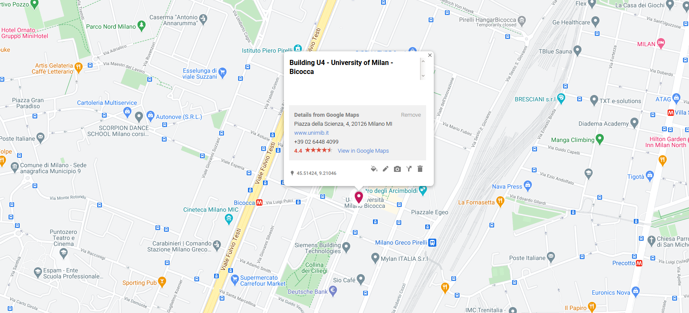

# How to participate
To participate you need to register (step 1/2) and potentially, to submit an abstract (step 2/2). 

<u>Deadline:</u> January 27

### 1/2: Registration (mandatory) 

* Participation is free, but registration is mandatory. Please fill this [form](https://docs.google.com/forms/d/e/1FAIpQLSevYzjniyLKGT93ryzwqvaaotoBV0BZuqeNUGYQb7ZksyB5iw/viewform?usp=sf_link).

The number of attendees is limited. Avoid late registrations.

### 2/2: Submit an abstract
<!-- If you wish to present a talk, submit your abstract via [EasyChair](https://easychair.org/my/conference?conf=dsb2021) -->

As previously, there is no formal review, and the organizers reserve the  right to select talks from the submissions to obtain a diverse and  interesting program. 

## Slides

Link to all provided slides will be provided soon.

## Program

The program will be provided soon.

## Participants

[Find your name here]({{ site.baseurl }})

## Mailing List
We use the dsb2021-groups@unimib.it mailing list for discussions and the diffusion of fresh informations. 
You will be added to the mailing list when you register.

* i  To unsubscribe: send email to dsb2021-groups+unsubscribe@unimib.it

# Practical
#### When
<!-- * any time before January 15: register and submit a talk (via [EasyChair](https://easychair.org/my/conference?conf=dsb2020)) -->
* February 11 (Thursday): first workshop day; dinner
* February 12 (Friday): second workshop day

#### Where

 

The workshop will take place at Università di Milano - Bicocca, U4 building, Milano, Italy, if the health situation will allow it.
Otherwise it will be an online workshop.

#### How to get there?

[Click here to go to Google Maps](https://www.google.com/maps/d/edit?mid=15abaZDT8Q0l6jSsy58cDcDXghLLVOc8o&usp=sharing)

The building is close to the Bicocca underground station Bicocca of the 
([MM5](https://en.wikipedia.org/wiki/Milan_Metro_Line_5)) line.

Milan is easily reachable by all major European and main international airports.
Milano Linate airport (code LIN) is the closest airport: it takes less
than 30 minutes to reach us via taxi and 1 hour by public
transportation.

### Hotels
The suggested hotels are [Starhotel Tourist](http://www.starhotels.com/en/our-hotels/tourist-milan/) and [Hotel Arcimboldi](http://www.hotelarcimboldi.it/en/) that are both within a 5-minute walk from the workshop site.

## Supports
This meeting is supported by 

*  [Università di Milano - Bicocca](https://www.unimib.it)
*  [PANGAIA](https://www.pangenome.eu/)

## Organizers

* Paola Bonizzoni
* Gianluca Della Vedova
* Yuri Pirola
* Raffaella Rizzi
