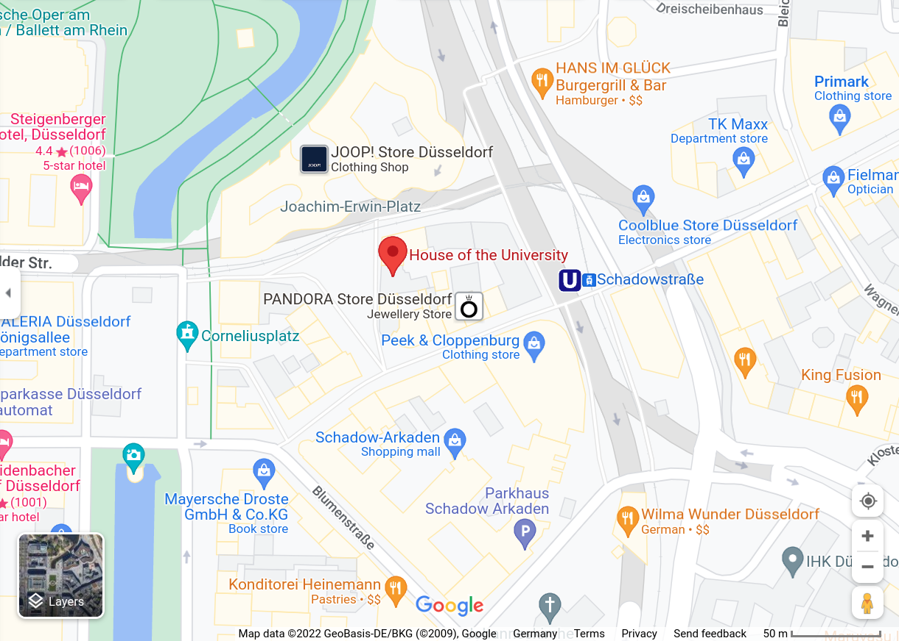

# How to participate
* <u>Presenting:</u> Please submit your abstract as a 1 page PDF to [EasyChair](https://easychair.org/conferences/?conf=dsb2022).

* <u>Attending:</u> Please submit an **empty** application to the same EasyChair link. (Note: EasyChair will ask for 3 keywords, if attending only, just put any 3 keywords to finish the submission)

<u>Deadline:</u> May 22nd.

<u>Decision:</u> May 27th.

<u>Participation Confirmation Deadline:</u> May 30th

<!-- 
### 1/2: Registration (mandatory)

* Participation is free, but registration is mandatory. Registrations are now closed. -->
<!-- 
## Important Notice

**All participants should have received an email with the instructions for joining the workshop.** If you have not received such an email,
please contact Yuri Pirola (yuri.pirola@unimib.it) as soon as possible. -->

## Submit an abstract

As previously, there is no formal review, and the organizers reserve the right to select talks from the submissions to obtain a diverse and  interesting program.

## Program

Coming soon.

## Participants
If you do not wish to have your name on the list, please email us.  
[Find your name here]({{ site.baseurl }})

# Practical
#### When
<!-- * any time before January 15: register and submit a talk (via [EasyChair](https://easychair.org/my/conference?conf=dsb2020)) -->
* June 13 (Monday): first workshop day
* June 13 (Tuesday): second workshop day

#### Where

The workshop will take place in Düsseldorf, Germany at Haus der Universität building in the city center. [Here](https://www.hdu.hhu.de/en/service-page) are information on how to get there.

#### Where to stay
Haus der Universität is in the center of the city, if you stay in any of these areas (not an exhaustive list), you can get to the venue quite easily.
* Main staion (Düsseldorf Hbf) would be not more than 10 to 15 minutes walk.
* Old city (Altstadt)
* Unterbilk
* Bilk
* Pempelfort
* Flingern Nord

If you stay around the University which is in the south of the city, it is not more than 10 to 15 minutes by metro to the venue. Please do not hesitate to email <a href="mailto:fawaz@hhu.de">Fawaz Dabbaghie</a> for information about the city.
<!-- ## Supports
This meeting is supported by -->

<!-- *  [Università di Milano - Bicocca](https://www.unimib.it)
*  [PANGAIA](https://www.pangenome.eu/) -->

## Organizers
* Fawaz Dabbaghie
* Daniel Doerr
* Sabine Gierling
* Gunnar Klau
* Tobias Marschall
* Max Ried Jakub