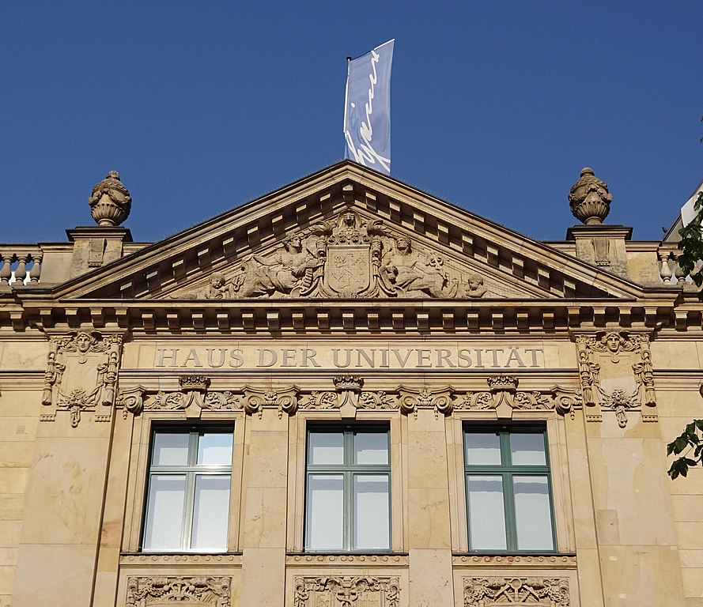

## How to participate

**Presenting:** Please submit your abstract as a 1 page PDF to [EasyChair](https://easychair.org/conferences/?conf=dsb2022). With the approval of the authors (OPT-IN), talks will be recorded and made available online after the conference. We also welcome presentations on work in progress.

**Attending:** Please submit an **empty** application to the same EasyChair link. EasyChair will ask for 3 keywords, if attending only, just put any 3 keywords to finish the submission.

**Deadline:** May 22nd

**Decision:** May 27th

**Participation Confirmation Deadline:** May 30th

## Submit an abstract

As previously, there is no formal review, and the organizers reserve the right to select talks from the submissions to obtain a diverse and interesting program.

## Program

* Day 1: 13th of June 2022, 09:00 - 18:00

|      **Topic**       |         **Speaker**        |    **Time**   |
| :------------------- | :------------------------- | :------------ |
| _Welcoming_          | Tobias/Gunnar              | 09:00 - 09:15 |
| Pangenome            | Rayan Chikhi               | 09:20 - 09:45 |
| Pangenome            | Andreas Rempel             | 09:45 - 10:10 |
| Pangenome            | Nicola Cotumaccio          | 10:10 - 10:35 |
| Application          | Ramin Shirali Hossein Zade | 10:35 - 11:00 |
| Application          | Jasper van Bemmelen        | 11:00 - 11:25 |
| Application          | Sandra Romain              | 11:25 - 11:50 |
|                      |                            |               |
| _Lunch break/coffee_ |                            |               |
|                      |                            |               |
| Pangenome            | Luca Parmigiani            | 13:20 - 13:45 |
| Pangenome            | Manuel Cáceres             | 13:45 - 14:10 |
| Pangenome            | Gianluca Della Vedova      | 14:10 - 14:35 |
| Indexing             | Antoine Limasset           | 14:35 - 15:00 |
| Indexing             | Lucas Robidou              | 15:00 - 15:25 |
|                      |                            |               |
| _Coffee break_       |                            | 15:25 - 15:50 |
|                      |                            |               |
| Indexing             | Roland Wittler             | 15:50 - 16:30 |
| Indexing             | Yoshihiro Shibuya          | 16:30 - 16:55 |
| Indexing             | Sebastian Schmidt          | 16:55 - 17:20 |
| Indexing             | Victor Epain               | 17:30 - 17:55 |

* Day 2: 14th of June 2022, 09:00 - 16:00

|      **Topic**       |         **Speaker**        |    **Time**   |
| :------------------- | :------------------------- | :------------ |
| Founder              | Nicola Rizzo               | 09:00 - 09:25 |
| Founder              | Konstantinn Bonnet         | 09:25 - 09:50 |
| Founder              | Karel Brinda               | 09:50 - 10:15 |
| Theory               | Barış Ekim                 | 10:15 - 10:40 |
| Theory               | Pengfei Wang               | 10:40 - 11:05 |
| Theory               | Diego Diaz                 | 11:10 - 11:35 |
|                      |                            |               |
| _Lunch break/coffee_ |                            |               |
|                      |                            |               |
| Indexing             | Jarno Alanko               | 13:00 - 13:25 |
| Indexing             | Giulio Ermanno Pibiri      | 13:25 - 13:50 |
| Indexing             | Jens Zentgraf              | 13:50 - 14:15 |
| Flow                 | Fernando Hugo Cunha Dias   | 14:20 - 14:45 |
| Flow                 | Frederick Oehl             | 14:45 - 15:10 |
| Flow                 | Andreas Grigorjew          | 15:10 - 15:35 |
|                      |                            |               |
| _Closing remarks_    |                            |               |

## Participants

If you do not wish to have your name on the list, please contact us at [dsb2022@hhu.de](mailto:dsb2022@hhu.de)!
[Find your name here]({{ site.baseurl }})

## Practical

### When

* Monday, June 13, 09:00 to 18:00: first workshop day
* Tuesday, June 14, 09:00 to 16:00: second workshop day

### Where

<iframe width="600" height="500" id="gmap_canvas" src="https://maps.google.com/maps?q=Haus%20der%20Universit%C3%A4t%20D%C3%BCsseldorf&t=&z=17&ie=UTF8&iwloc=&output=embed" frameborder="0" scrolling="no" marginheight="0" marginwidth="0"></iframe>

The workshop will take place in Düsseldorf, Germany at Haus der Universität building in the city center. [Here](https://www.hdu.hhu.de/en/service-page) are information on how to get there.

### Where to stay

Haus der Universität is in the center of the city, if you stay in any of these areas (not an exhaustive list), you can get to the venue quite easily.

* Main staion (Düsseldorf Hbf) would be not more than 10 to 15 minutes walk.
* Altstadt
* Unterbilk
* Bilk
* Pempelfort
* Flingern Nord

If you stay around the University which is in the south of the city, it is not more than 10 to 15 minutes by metro to the venue. Please do not hesitate to write an [email](mailto:dsb2022@hhu.de) for information about the city.

## Organizers

* Fawaz Dabbaghie
* Daniel Doerr
* Sabine Gierling
* Gunnar Klau
* Tobias Marschall
* Max Ried

---

## Picture Index

* "Marktplatz" by Anil Öztas
* "Haus der Universität" by Jula2812, CC BY-SA 4.0 <https://creativecommons.org/licenses/by-sa/4.0>, via Wikimedia Commons
