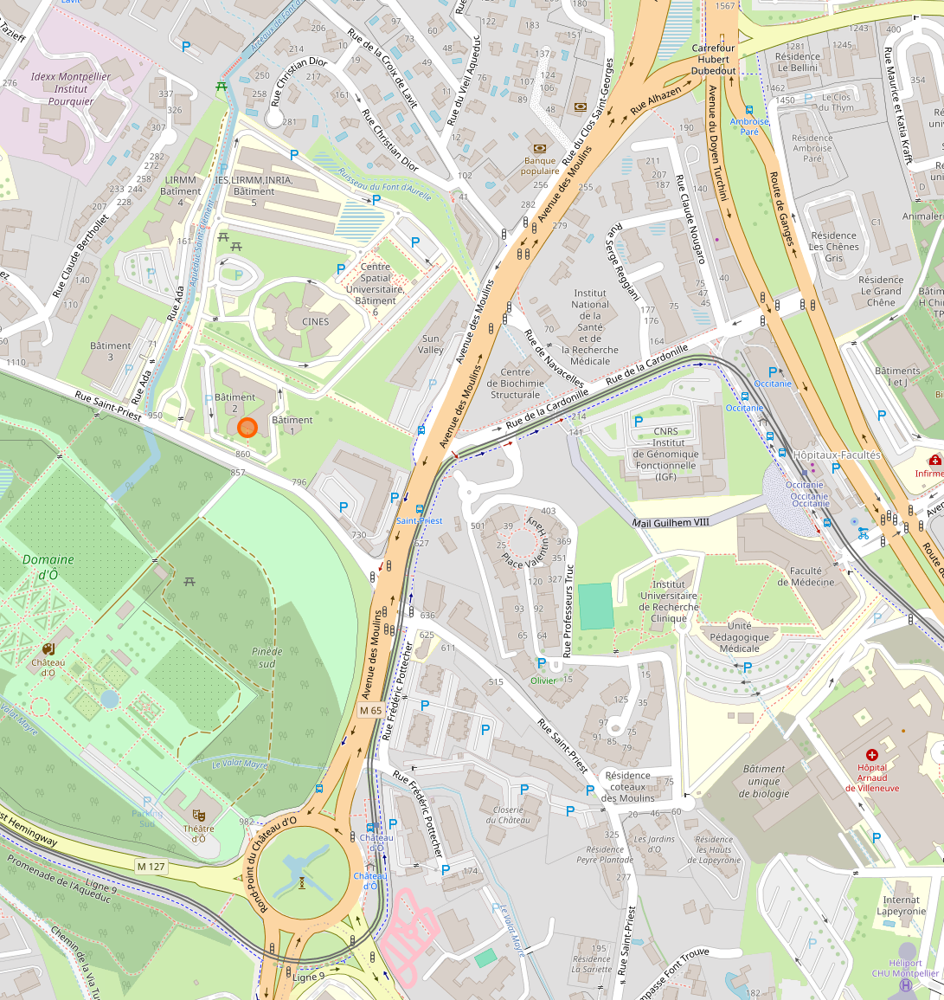
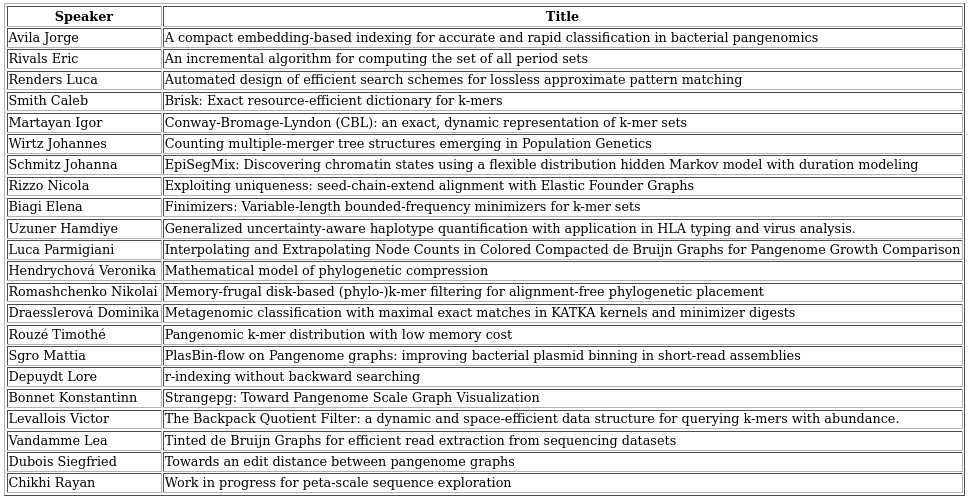

## Where and when

DSB 2024 will be organized in Montpellier, South of France

on the Campus St Priest, from Montpellier University

on March 14-15 in 2024.

The workshop  will take place in the Amphitheatre of Building #2 of the Campus (see map below).

- GPS coordinates: 43,6351948 ; 3,8414903
- [Location view on OpenStreetMap](https://www.openstreetmap.org/#map=18/43.6351948/3.8414903 "Workshop Venue Location")
- [View Location on Google Maps](https://maps.app.goo.gl/96Sb9vwir7RE9uih6 "Workshop Venue Location")
- Local map with building #2 entrance highlighted. An door to the campus is just 15 m away.
  The nearest Tram station is "Chateau d'O", located at the roundabout of the same name.
   

## Program

The detailed program is available as pdf file: [DSB program](./dsb_2024_detailed_prog.pdf "DSB 2024 program")

The list of selected abstracts is below:

   
  
## Organizers
From team "Methods & Algorithms for Bioinformatics":
- Jordan Moutet (LIRMM - CNRS et Univ. Montpellier)
- [Eric Rivals](https://www.lirmm.fr/~rivals/)  (LIRMM - CNRS et Univ. Montpellier)
- Nikolai Romashchenko (LIRMM - CNRS et Univ. Montpellier)
- Pengfei Wang (LIRMM - CNRS et Univ. Montpellier)

and the LIRMM Communication unit
- Virginie Fêche 
- Elena Demchenko

For any questions about DSB2024, please reach out to [rivals@lirmm.fr](mailto:rivals@lirmm.fr).

## Sponsors

Lots of thanks for the financial support of:

1. The ITN network [ALPACA](https://alpaca-itn.eu/ "ALPACA webpage") Marie-Curie
2. The french CNRS research network for bioinformatics: the [GDR BIM](https://www.gdr-bim.cnrs.fr/ "GDR BIM wepbage")

        

## How to participate

Registration for participating to DSB 2024 is free and now closed.

Registrations and submissions are now open at: [https://dsb-2024.sciencesconf.org/](https://dsb-2024.sciencesconf.org/ "dsb registration site")

Deadline for registration: February 20th, 2024.

## Abstract submission

You can submit an abstract (max 300 words) via the Sciencesconf system at
 [https://dsb-2024.sciencesconf.org/](https://dsb-2024.sciencesconf.org/ "dsb submission site")

To do so, you will be required to register by creating an account with your professional email.

 **Abstract submission deadline (postponed): February ~~1st~~ 10th, 2024**.

As previously, there is no formal review. We intend to give everyone the opportunity to present but the organizers reserve the right to select talks from the submissions to obtain a diverse and interesting program.

## Information about Montpellier

Most tourist attractions, historic museums, cultural hubs, tasty restaurants are around the city center of Montpellier. Staying around this area. For instance, near the Place de la Comédie, is a good option.  For more travelling information about Montpellier, the following link could be helpful: <https://www.montpellier-france.com/>

### Hotels in Montpellier, France
Some  suggestions for hotels:

-  Hôtel du [Palais](https://www.hoteldupalais-montpellier.fr/)
   3 rue du Palais des Guilhem - 34000 Montpellier
   +33 (0)4 67 60 47 38
   mail: hoteldupalaismontpellier@gmail.com
-  Hôtel du [Parc](https://www.hotelduparc-montpellier.com/)
   8 rue achille bégé 34090 Montpellier France
   04 67 41 16 49
   mail: contact@leparc34.fr
-  Hôtel Les [Troènes](https://www.hotel-les-troenes.fr/)
   near Universités & des Hopitaux
   17 avenue Emile Bertin-sans, à Montpellier
   04.67.04.07.76.
   hotel-les-troenes@wanadoo.fr
-  Best Western Hotel [Comedie Saint-Roch](https://www.bestwestern.fr/fr/hotel-Montpellier-Best-Western-Plus-Hotel-Comedie-Saint-Roch-93831)
   6 & 8 rue Jules Ferry, 34000, Montpellier France 
   Tel : +33 04 99 13 33 44
   Email : contact@lhotel-montpellier.com
-  Hôtel des [Arceaux](https://www.hoteldesarceaux.com/en/)
   33-35, boulevard des arceaux, 34000 Montpellier
   +33 (0)4 67 92 03 03
   <https://www.hoteldesarceaux.com/en/>

### Credits
Photo de Julien Daga sur [Unsplash](https://unsplash.com/fr/photos/un-groupe-de-personnes-debout-au-sommet-dun-escalier-J5iirAB17TA?utm_content=creditCopyText&utm_medium=referral&utm_source=unsplash)

