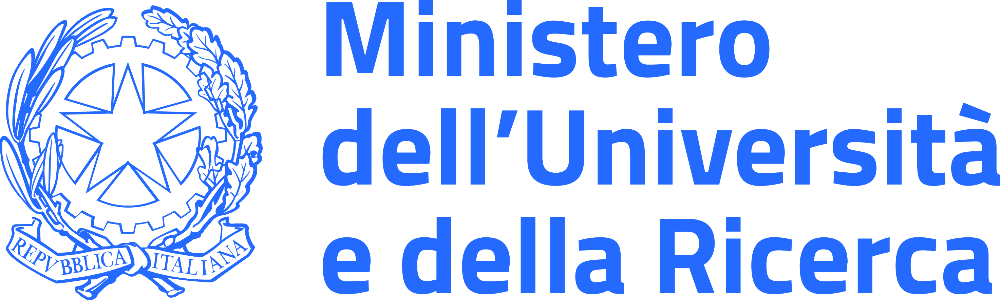

## Where and when

DSB 2025 will take place at the [Department of Computer Science](https://di.unipi.it/en/), [University of Pisa](https://www.unipi.it/index.php/english), Italy on **March 5-6, 2025**.

<iframe src="https://www.google.com/maps/embed?pb=!1m18!1m12!1m3!1d2883.5263153872324!2d10.40570357654915!3d43.72039217109893!2m3!1f0!2f0!3f0!3m2!1i1024!2i768!4f13.1!3m3!1m2!1s0x12d591bcbfe591bb%3A0x91d311f58e2115b6!2sDipartimento%20di%20Informatica!5e0!3m2!1sit!2sit!4v1732374209673!5m2!1sit!2sit" width="750" height="400" style="border:0;margin-bottom:20px;" allowfullscreen="" loading="lazy" referrerpolicy="no-referrer-when-downgrade"></iframe>

## How to participate

**Abstract submission deadline:** February 1st, 2025 AoE. Expired.

**Registration deadline:** February 15th, 2025 AoE.
[Register here](https://forms.office.com/e/3qczYFZTCh)

As in previous editions, there will be no formal review process. While we aim to provide everyone with an opportunity to present, the organizers reserve the right to select talks from the submissions to ensure a diverse and engaging program.

## Confirmed participants

*Updated as of February 11th, 2025*

- Ackermann Léo, Univ. Rennes, Inria, CNRS, IRISA
- Alfredo Carmona Tabja Gabriel, University of Pisa
- Ascone Rocco, University of Trieste
- Becker Ruben, Ca' Foscari University of Venice
- Bernardini Giulia, University of Milan
- Biagi Elena, University of Helsinki
- Bohnenkämper Leonard, Bielefeld University
- Bohuslavova Dominika, Czech Technical University in Prague
- Bonizzoni Paola, Università di Milano Bicocca
- Böttcher Stefan, Paderborn University
- Brunetti Francesca, Sapienza University of Rome
- Campanelli Alessio, Ca' Foscari University of Venice
- Carfagna Lorenzo, University of Pisa
- Cenzato Davide, Ca' Foscari University of Venice
- Cioni Lapo, Università degli Studi di Firenze
- Depuydt Lore, Ghent University - imec
- Elena Schmitz Johanna, Saarland University
- Flege Patrick, Wageningen University & Research
- Gao Younan, University of Milano-Bicocca
- Gargiulo  Francesco, Università di Pisa
- Girard Mathilde, University of Lille
- Groot Koerkamp Ragnar, ETH Zurich
- Grossi Roberto, Università di Pisa
- Guerrini Veronica, University of Pisa
- Ingels Florian, Université de Lille
- Levallois Victor, Inria Rennes
- Lipták Zsuzsanna, University of Verona
- Lucà Simone, University of Verona
- Manzini Giovanni, University of Pisa
- Mwaniki Njagi, University of Pisa
- Parmigiani Luca, Bielefeld University
- Pibiri Giulio Ermanno, Ca' Foscari University of Venice
- Pisanti Nadia, University of Pisa
- Prezza Nicola, Ca' Foscari University of Venice
- Punzi Giulia, University of Pisa
- Puttini Daniel, Ca' Foscari University of Venice
- Regnier Alix, Inria - GenScale
- Rivals Eric,  LIRMM (CNRS) & Univ. Montpellier
- Rizzo Nicola, University of Helsinki
- Robidou Lucas, Bielefeld University, Germany
- Romana Giuseppe, University of Palermo
- Rosone Giovanna, University of Pisa - Italy
- Rouzé Timothé, Institut Pasteur Paris
- Savino Angelo, Università di Pisa
- Sena Francisco, University of Helsinki
- Stoye Jens, Bielefeld University
- Tosoni Carlo, Ca' Foscari University
- Venturini Rossano, University of Pisa
- Vinciguerra Giorgio, University of Pisa
- Wiegand Felix, Bioinformatics and Computational Oncology (Kösterlab), University Duisburg-Essen
- Zentgraf Jens, Saarland University

## Program

TBA

## Organizers

- Nadia Pisanti, University of Pisa
- Giorgio Vinciguerra, University of Pisa
- Veronica Guerrini, University of Pisa
- Njagi Mwaniki, University of Pisa
- Giovanni Buzzega, University of Pisa
- Giovanna Rosone, University of Pisa

For any questions about DSB 2025, please reach out to [nadia.pisanti@unipi.it](mailto:nadia.pisanti@unipi.it).

## Sponsors

Lots of thanks for the financial support of:

1. [Department of Computer Science, University of Pisa](https://di.unipi.it/en/)
2. [PINC Pangenome INformatiCs](https://pinc-miur.disco.unimib.it/) 
3. [ALPACA ALgorithms for PAngenome Computational Analysis](https://alpaca-itn.eu)
4. [THE Tuscany Health Ecosystem, Spoke 6](https://tuscanyhealthecosystem.it) 

{: height="50" }  {: height="50" }  {: height="50" }  {: height="50" }

{: height="50" } {: height="50" }  {: height="50" }

## Information about Pisa

**Travel.** Pisa is conveniently served by [Galileo Galilei International Airport](https://www.pisa-airport.com/en/).
For additional travel options, the nearest alternative airport is Florence’s [Amerigo Vespucci Airport](https://www.aeroporto.firenze.it/en/). From there, you can take tram line T2 to the main train station, Firenze Santa Maria Novella. From this station, regular [regional trains](https://www.trenitalia.com/en.html) run directly to Pisa, with a travel time of about one hour.

**Getting Around Pisa.** Pisa is a compact and pedestrian-friendly city, with most attractions and key locations within easy walking distance. Buses are also readily available: you can easily find directions using Google Maps and buy tickets on board using [contactless payment options](https://www.at-bus.it/en/tiptap).

**Tourism.** For information on local attractions, historical sites, guided tours, and more, please visit the official tourism website of Pisa: [turismo.pisa.it](https://www.turismo.pisa.it/en/node). You’ll find everything you need to explore the city’s rich history, enjoy its vibrant culture, and discover hidden gems beyond the famous Leaning Tower.

<small>
Aerial picture of Piazza dei Miracoli by [Guglielmo Giambartolomei](https://it.wikipedia.org/wiki/File:Piazza_dei_miracoli_-_aerial_panorama.jpg).
</small>
