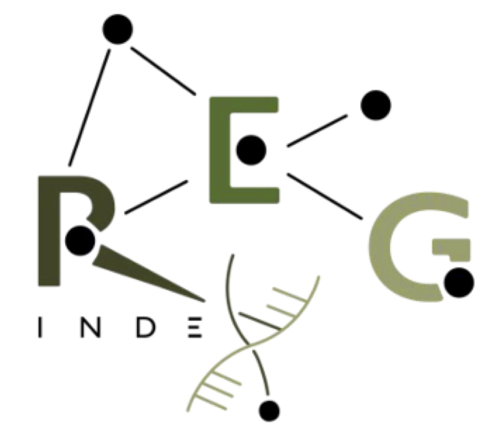

## Where and when

DSB 2026 will take place at [Aula Magna Silvio Trentin](https://www.unive.it/pag/31150/), [Ca' Foscari University of Venice](https://www.unive.it/web/en/497/home), Venice, Italy on **February 18-19, 2026**.  
• <small>Opening: February 18, 8:30–8:45</small>  
• <small>Closing: February 19, 17:50–18:00</small>

<iframe src="https://www.google.com/maps/embed?pb=!1m18!1m12!1m3!1d9360.59882355841!2d12.321188403211007!3d45.437693960916135!2m3!1f0!2f0!3f0!3m2!1i1024!2i768!4f13.1!3m3!1m2!1s0x477eb1cf4046f745%3A0x5eba211ce81fa5bf!2sAula%20magna%20Silvio%20Trentin!5e0!3m2!1sit!2sit!4v1755727841052!5m2!1sit!2sit" width="100%" height="400" style="border:0;margin-bottom:20px;" allowfullscreen="" loading="lazy" referrerpolicy="no-referrer-when-downgrade"></iframe>

## How to participate

**Abstract submission deadline:** To be announced.

**Registration deadline:** To be announced.

As in previous editions, there will be no formal review process. While we aim to provide everyone with an opportunity to present, the organizers reserve the right to select talks from the submissions to ensure a diverse and engaging program.

For this edition, there will be no registration fee.

## Organizers

- Nicola Prezza, Ca' Foscari University of Venice
- Ruben Becker, Ca' Foscari University of Venice
- Giulio Ermanno Pibiri, Ca' Foscari University of Venice
- Alessio Campanelli, Ca' Foscari University of Venice
- Carlo Tosoni, Ca' Foscari University of Venice
- Daniel Puttini, Ca' Foscari University of Venice
- Davide Cenzato, Ca' Foscari University of Venice
- Davide Tonetto, Ca' Foscari University of Venice
- Riccardo Maso, Ca' Foscari University of Venice
- Sung-Hwan Kim, Ca' Foscari University of Venice

For any questions about DSB 2026, please reach out to [dsb26-organization-grpunive@unive.it](mailto:dsb26-organization-grpunive@unive.it).

## Sponsors

Lots of thanks for the financial support of:

- [Ca' Foscari University of Venice](https://www.unive.it/web/en/497/home)
- [REGINDEX: Compressed Indexes for Regular Languages with Applications to Computational Pan-genomics.](https://pric.unive.it/projects/regindex/home)

<small>Funded by ERC StG “REGINDEX: Compressed indexes for regular languages with applications to computational pan-genomics” grant nr 101039208. Views and opinions expressed are however those of the author(s) only and do not necessarily reflect those of the European Union or the European Research Council Executive Agency. Neither the European Union nor the granting authority can be held responsible for them.</small> 

{: height="180" }  {: height="190" }

## Information about Venice

**Travel.** Venice is conveniently served by [Venice Marco Polo Airport](https://www.veniceairport.it/en/), located on the mainland approximately 13 kilometers (8 miles) north of Venice. For additional travel options, the nearest alternative airport is Treviso’s [Antonio Canova Airport](https://www.trevisoairport.it/en/). From either airport, you can easily reach Venice by bus, water shuttle, or train; see the [arriving-by-plane](https://events.veneziaunica.it/en/plan-your-trip/arriving-by-plane) Venezia Unica webpage for detailed information. On top of that, the main train station, [Venezia Santa Lucia](https://www.trenitalia.com/en.html), is well connected, with regular regional and high-speed trains from throughout Italy.

**Getting Around in Venice.** For getting around Venice, the public waterbus service (vaporetti) is the most convenient option. You can check real-time schedules, routes, and stop information using the website and app [CheBateo](https://chebateo.it/). It's a helpful tool to plan your trips across the old city and nearby islands efficiently.

**Tourism.** For information on attractions, historical sites, guided tours, and events, you can visit the official tourism website of Venice: [Venezia Unica](https://www.veneziaunica.it).

## Accommodation

Venice and Mestre offer a wide range of accommodation options. You can stay in Mestre (for example, [Hotel Alexander](https://www.hotelalexander.com/)) and reach the city center easily by public transport, taking 10–15 minutes by train or bus. Alternatively, you can stay in Venice old town, within walking distance of the conference venue (for example, [Albergo Marin](https://www.albergomarin.it/), ~10 minutes; [Hotel Sangallo](https://hotelsangallo.com/), ~25 minutes).

<small>
The picture of Piazza San Marco was downloaded from [Pexels.com](https://www.pexels.com/).
</small>
