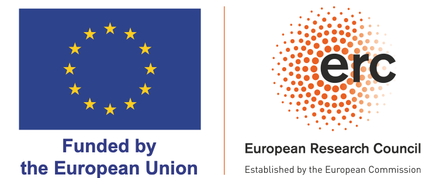

## Where and when

DSB 2026 will take place at [Aula Magna Silvio Trentin](https://www.unive.it/pag/31150/), [Ca' Foscari University of Venice](https://www.unive.it/web/en/497/home), Venice, Italy on **February 18-19, 2026**. <customStrong><em>The entrance to the building is through Giardino di Ca’ Dolfin</em></customStrong>.  
• <small>Opening: February 18, 8:30–8:45</small>  
• <small>Closing: February 19, 17:50–18:00</small>

<iframe src="https://www.google.com/maps/embed?pb=!1m18!1m12!1m3!1d479.23971981047174!2d12.325710862267028!3d45.43510351758851!2m3!1f0!2f0!3f0!3m2!1i1024!2i768!4f13.1!3m3!1m2!1s0x477eb1735b0a0133%3A0x8daeee83f6c15b4c!2sGiardino%20di%20Ca%E2%80%99%20Dolfin!5e1!3m2!1sen!2sit!4v1761556482418!5m2!1sen!2sit" width="100%" height="400" style="border:0;margin-bottom:20px;" allowfullscreen="" loading="lazy" referrerpolicy="no-referrer-when-downgrade"></iframe>

<!--
<iframe src="https://www.google.com/maps/embed?pb=!1m18!1m12!1m3!1d9360.59882355841!2d12.321188403211007!3d45.437693960916135!2m3!1f0!2f0!3f0!3m2!1i1024!2i768!4f13.1!3m3!1m2!1s0x477eb1cf4046f745%3A0x5eba211ce81fa5bf!2sAula%20magna%20Silvio%20Trentin!5e0!3m2!1sit!2sit!4v1755727841052!5m2!1sit!2sit" width="100%" height="400" style="border:0;margin-bottom:20px;" allowfullscreen="" loading="lazy" referrerpolicy="no-referrer-when-downgrade"></iframe>
-->

## How to participate

**Abstract submission deadline:** ~~January 2nd~~ January 9th, 2026 AoE. *Closed*. <!--[Click here to reach the abstract submission form](https://forms.gle/baHkDCZW1Lvx1xZT6).-->

**Registration deadline:** January 31st, 2026 AoE. [Click here to reach the registration form]( https://forms.gle/V9yrUXYvAsTPpq6J7).

As in previous editions, there will be no formal review process. While we aim to provide everyone with an opportunity to present, the organizers reserve the right to select talks from the submissions to ensure a diverse and engaging program.

For this edition, there will be no registration fee.

<h2 style="margin-bottom: 50px;">Program</h2>

<!--  -->

 

**Wednesday, 18 February**    

|               |   |
|---------------|---|
| <nobr>8:30 - 8:55  </nobr> | <ins>Registration</ins> |
| <nobr>8:55 - 9:00  </nobr> | <ins>Opening</ins> |

| <nobr>             </nobr> | **Session 1: Data Structures and Indexing 1** ( Chair: TBA ) |
| <nobr>9:00 - 9:25  </nobr> | <ins><i>Limasset Antoine</i></ins>. *Zor Filters: Fast and Smaller Than Binary Fuse Filters* |
| <nobr>9:25 - 9:50  </nobr> | <ins><i>Ragnar Groot Koerkamp</i></ins>. *QuadRank: Engineering a High Throughput Rank* |
| <nobr>9:50 - 10:15 </nobr> | <ins><i>Nicola Rizzo</i></ins>, Nadia Pisanti, Veli Mäkinen. *On the construction of Elastic Degenerate Strings* |

| <nobr>10:15 - 10:45</nobr> | <ins>Break</ins> |

| <nobr>             </nobr> | **Session 2: Comparative Genomics 1** ( Chair: TBA ) |
| <nobr>10:45 - 11:10</nobr> | Luca Renders, <ins><i>Lore Depuydt</i></ins>, Travis Gagie, Jan Fostier. *Columba: Fast Approximate Pattern Matching with Optimized Search Schemes* |
| <nobr>11:10 - 11:35</nobr> | Leonard Bohnenkämper, Luca Parmigiani, <ins><i>Kamil Hepak</i></ins>, Cedric Chauve, Jens Stoye. *MICE: Deriving Synteny Blocks by Compacting Elements* |
| <nobr>11:35 - 12:00</nobr> | <ins><i>Fawaz Dabbaghie</i></ins>, Martin Steinegger. *gfaidx: sorting and indexing GFA graphs based on topology for node-based random access* |
| <nobr>12:00 - 12:25</nobr> | <ins><i>Tam Truong</i></ins>, Dominique Lavenier, Pierre Peterlongo, Karel Břinda. *Phylogenetic ordering and batching of million-genome collections for reduced storage and faster retrieval* |

| <nobr>12:25 - 14:00</nobr> | <ins>Lunch</ins> |

| <nobr>             </nobr> | **Session 3: Compressed data structures** ( Chair: TBA )  |
| <nobr>14:00 - 14:25</nobr> | Paola Bonizzoni, Davide Cozzi, <ins><i>Younan Gao</i></ins>. *Optimal-Time Mapping in Run-Length Compressed PBWT* |
| <nobr>14:25 - 14:50</nobr> | Lorenzo Carfagna, <ins><i>Carlo Tosoni</i></ins>. *New Entropy Measures for Tries with Applications to the XBWT* |
| <nobr>14:50 - 15:15</nobr> | <ins><i>Davide Tonetto</i></ins>, Alessio Campanelli, Ruben Becker, Nicola Prezza. *A New Compression Technique for Repetitive Wheeler DFAs* |
| <nobr>15:15 - 15:40</nobr> | <ins><i>Davide Cologni</i></ins>, Sebastiano Vigna. *Fast, Parallel, and Scalable Differential Graph Compression* |

| <nobr>15:40 - 16:10</nobr> | <ins>Break</ins> |

| <nobr>             </nobr> | **Session 4: Transcriptomics and Gene Expression** ( Chair: TBA )  |
| <nobr>16:10 - 16:35</nobr> | <ins><i>Inês Alves Ferreira</i></ins>, Jens Zentgraf, Johanna Elena Schmitz, Sven Rahmann. *PanXpress: Gene expression estimation from a pan-transcriptomic reference using a gapped k-mer index* |
| <nobr>16:35 - 17:00</nobr> | <ins><i>Johanna Elena Schmitz</i></ins>, Jens Zentgraf, Sven Rahmann. *Error Correction Algorithms for Efficient Gene Expression Quantification in Single Cell Transcriptomics* |
| <nobr>17:00 - 17:25</nobr> | <ins><i>Degardins Bastien</i></ins>, Marchet Camille, Paperman Charles. *Optimizing de Bruijn Graph Parameters for Fusion and Splicing Event Detection in RNA Sequencing Data: First attempt at a comprehensive evaluation within the Vizitig Framework* |
| <nobr>17:25 - 17:50</nobr> | The Transipedia Consortium, <ins><i>Camille Marchet</i></ins>. *The Transipedia project: index human transcriptomes for biomedical research* |

 

**Thursday, 19 February**

|               |   |
|---------------|---|
| <nobr>  </nobr> | **Session 5: Sampling and Sketching** ( Chair: TBA )  |
| <nobr> 9:00 - 9:25  </nobr> | Jarno N. Alanko, <ins><i>Elena Biagi</i></ins>, Simon J. Puglisi. *Fast approximate pseudoalignment with finimizers* |
| <nobr> 9:25 - 9:50  </nobr> | Florian Ingels, <ins><i>Lucas Robidou</i></ins>, Igor Martayan, Camille Marchet, and Antoine Limasset. *Minimizer Density revisited: Models and Multiminimizers* |
| <nobr> 9:50 - 10:15 </nobr> | Leonardo Gemin, <ins><i>Cinzia Pizzi</i></ins>, Matteo Comin. *Fast hashing of spaced seeds with DuoHash* |

| <nobr> 10:15 - 10:45</nobr> | <ins>Break</ins> |

| <nobr>              </nobr> | **Session 6: Comparative Genomics 2**  ( Chair: TBA )  |
| <nobr> 10:45 - 11:10</nobr> | Jorge Avila Cartes, Simone Ciccolella, Luca Denti, Raghuram Dandinasivara, Gianluca Della Vedova, Paola Bonizzoni, <ins><i>Alexander Schönhuth</i></ins>. *PanSpace: Fast and Scalable Indexing for Massive Bacterial Databases* |
| <nobr> 11:10 - 11:35</nobr> | <ins><i>Jasmijn Baaijens</i></ins>. *Less is more: optimal reference set selection with ReSeT* |
| <nobr> 11:35 - 12:00</nobr> | <ins><i>Daniel Puttini</i></ins>, Ruben Becker, Nicola Prezza, Sung-Hwan Kim, Davide Cenzato. *A near-optimal algorithm for the Wheelerization problem with applications to computational pangenomics* |
| <nobr> 12:00 - 12:25</nobr> | <ins><i>Alessio Campanelli</i></ins>, Giulio Ermanno Pibiri, Rob Patro. *Fast pseudoalignment queries on compressed colored de Bruijn graphs* |

| <nobr> 12:30 - 14:00</nobr> | <ins>Lunch</ins> |

| <nobr>              </nobr> | **Session 7: Data Structures and Indexing 2** ( Chair: TBA )  |
| <nobr> 14:00 - 14:25</nobr> | Tristan Dubos and <ins><i>Eric Rivals</i></ins>. *Combinatorial questions and algorithms related to the enumeration of b-canonical words* |
| <nobr> 14:25 - 14:50</nobr> | <ins><i>Victor Levallois</i></ins>, Yoshihiro Shibuya, Bertrand Le Gal, Rob Patro, Pierre Peterlongo, Giulio Ermanno Pibiri. *Advancing Kaminari: Scaling up to real-world datasets with limited RAM* |
| <nobr> 14:50 - 15:15</nobr> | <ins><i>Igor Martayan</i></ins>, Rob Patro, Camille Marchet. *Scalable indexing and mapping of long sequences through locally consistent phrases* |
| <nobr> 15:15 - 15:40</nobr> | <ins><i>Riccardo Maso</i></ins>, Nicola Prezza, Carlo Tosoni. *An Efficient Approach to Wheeler Graph Indexing* |

| <nobr> 15:40 - 16:10</nobr> | <ins>Break</ins> |

| <nobr>              </nobr> | **Session 8: k-mers and de Bruijn Graphs** ( Chair: TBA )  |
| <nobr> 16:10 - 16:35</nobr> | <ins><i>Florian Ingels</i></ins>, Antoine Limasset. *Improving minimizers-based k-mer partitioning* |
| <nobr> 16:35 - 17:00</nobr> | <ins><i>Jarno Alanko</i></ins>. *Constructing distinct color sets of k-mers* |
| <nobr> 17:00 - 17:25</nobr> | <ins><i>Alix Regnier</i></ins>, Pierre Peterlongo. *Compressing a petabyte of k-mer matrices* |
| <nobr> 17:25 - 17:50</nobr> | <ins><i>Andrea Cracco</i></ins>, Sebastian Schmidt, Pierre Peterlongo, Alexandru I. Tomescu. *Time-, Memory-, and Disk-Efficient Construction of Spectrum Preserving String Sets with GGCAT2* | 

| <nobr> 17:50 - 18:00</nobr> | <ins>Closing</ins> |

<!--## Organizers-->
<h2 style="margin-top: 25px;">Organizers</h2>

<!--
-->

  
 
    DSB 2026 is organized by the 
    <a href="https://raven-laboratory.github.io/">RAVEN</a> 
    (Research on Algorithms VENice) research group at Ca' Foscari University of Venice.
  

   

- Nicola Prezza, Ca' Foscari University of Venice
- Ruben Becker, Ca' Foscari University of Venice
- Giulio Ermanno Pibiri, Ca' Foscari University of Venice
- Alessio Campanelli, Ca' Foscari University of Venice
- Carlo Tosoni, Ca' Foscari University of Venice
- Daniel Puttini, Ca' Foscari University of Venice
- Davide Cenzato, Ca' Foscari University of Venice
- Davide Cologni, Ca' Foscari University of Venice
- Davide Tonetto, Ca' Foscari University of Venice
- Riccardo Maso, Ca' Foscari University of Venice
- Sung-Hwan Kim, Sant'Anna School of Advanced Studies

For any questions about DSB 2026, please reach out to [dsb26-organization-grpunive@unive.it](mailto:dsb26-organization-grpunive@unive.it).

## Sponsors

Lots of thanks for the financial support of:

- [Ca' Foscari University of Venice](https://www.unive.it/web/en/497/home)
- [REGINDEX: Compressed Indexes for Regular Languages with Applications to Computational Pan-genomics.](https://pric.unive.it/projects/regindex/home)

<small>Funded by ERC StG “REGINDEX: Compressed indexes for regular languages with applications to computational pan-genomics” grant nr 101039208. Views and opinions expressed are however those of the author(s) only and do not necessarily reflect those of the European Union or the European Research Council Executive Agency. Neither the European Union nor the granting authority can be held responsible for them.</small> 

{: height="180" }  {: height="190" }

## Information about Venice

**Travel.** Venice is conveniently served by [Venice Marco Polo Airport](https://www.veniceairport.it/en/), located on the mainland approximately 13 kilometers (8 miles) north of Venice. For additional travel options, the nearest alternative airport is Treviso’s [Antonio Canova Airport](https://www.trevisoairport.it/en/). From either airport, you can easily reach Venice by bus, water shuttle, or train; see the [arriving-by-plane](https://events.veneziaunica.it/en/plan-your-trip/arriving-by-plane) Venezia Unica webpage for detailed information. On top of that, the main train station, [Venezia Santa Lucia](https://www.trenitalia.com/en.html), is well connected, with regular regional and high-speed trains from throughout Italy.

**Getting Around in Venice.** For getting around Venice, the public waterbus service (vaporetti) is the most convenient option. You can check real-time schedules, routes, and stop information using the website and app [CheBateo](https://chebateo.it/). It's a helpful tool to plan your trips across the old city and nearby islands efficiently.

**Tourism.** For information on attractions, historical sites, guided tours, and events, you can visit the official tourism website of Venice: [Venezia Unica](https://www.veneziaunica.it).

## Accommodation

Venice and Mestre offer a wide range of accommodation options. You can stay in Mestre (for example, [Hotel Alexander](https://www.hotelalexander.com/)) and reach the city center easily by public transport, taking 10–15 minutes by train or bus. Alternatively, you can stay in Venice old town, within walking distance of the conference venue (for example, [Albergo Marin](https://www.albergomarin.it/), ~10 minutes; [Hotel Sangallo](https://hotelsangallo.com/), ~25 minutes).

<small>
The picture of Piazza San Marco was downloaded from [Pexels.com](https://www.pexels.com/).
</small>
