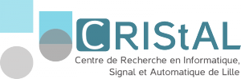
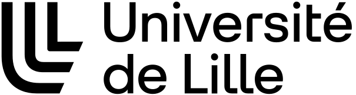

## Where and when

DSB 2027 will be held in **Lille, France**. Exact dates are **to be announced**.

## How to participate

- **Abstract submission deadline:** to be announced.
- **Registration deadline:** to be announced.

As in previous editions, there will be no formal review process. While we aim to provide everyone with an opportunity to present, the organizers reserve the right to select talks from the submissions to ensure a diverse and engaging program.

## Program

The scientific program for DSB 2027 will be published here once available.

## Organizers

DSB 2027 is organized by the [Bonsai team](https://www.cristal.univ-lille.fr/bonsai/) at CRIStAL, University of Lille.

**Organizing committee:**
- Pierre Berriet
- Bastien Cazaux
- Bastien Degardins
- Lore Depuydt
- Yoann Dufresne
- Antoine Limasset
- Camille Marchet

## Contact

<!-- For questions about DSB 2027, please contact the organizers at [bastien.cazaux@univ-lille.fr](mailto:bastien.cazaux@univ-lille.fr), [yoann.dufresne@univ-lille.fr](mailto:yoann.dufresne@univ-lille.fr), [antoine.limasset@univ-lille.fr](mailto:antoine.limasset@univ-lille.fr), or [camille.marchet@univ-lille.fr](mailto:camille.marchet@univ-lille.fr). -->

To stay up to date about future editions, subscribe to the [DSB-info mailing list](https://listserv.tudelft.nl/mailman/listinfo/dsb-info).

  
  
  

Header photo by <a href="https://unsplash.com/@tzielonka" style="color: #999;">Tomasz Zielonka</a> on <a href="https://unsplash.com" style="color: #999;">Unsplash</a>

